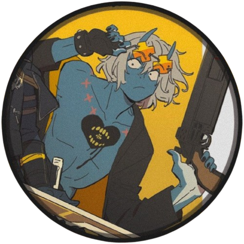

# Scrabble WPF - Mode deux joueurs

C'est une version du Scrabble conçue spécifiquement pour permettre à deux personnes de s'affronter sur le même ordinateur.

## Fonctionnement du mode deux joueurs

L'application gère l'essentiel de la partie automatiquement pour que les joueurs puissent se concentrer sur leurs mots :

* **Démarrage :** Au début de la partie, le prénom de chaque joueur est saisi 

* **Tour par tour :** Les joueurs jouent à tour de rôle. L’application désigne par tirage au sort le joueur qui doit commencer.
le joueur propose un mot composé avec les 7 lettres tirées au sort par l’application  

* **Affichage :** Tout au long de la partie, le score de chaque joueur est affiché 

* **Fin de partie :** La partie se termine lorsque les joueurs ont proposé chacun 10 mots. Le nom du gagnant est alors affiché par 
l’application. Les 10 mots du joueur gagnant ainsi que le mot qui a rapporté le plus grand nombre de points sont 
affichés également. 

## Détails techniques

Le projet utilise les technologies suivantes :
* C# / .NET
* Interface utilisateur en WPF
* Git pour le suivi des modifications

## Installation

1. Clonez le dépôt sur votre machine.
2. Ouvrez le fichier .sln avec Visual Studio.
3. Lancez la compilation pour tester l'application.

Le projet est actuellement en cours de développement, principalement sur la logique de validation des mots et la gestion des tours.

